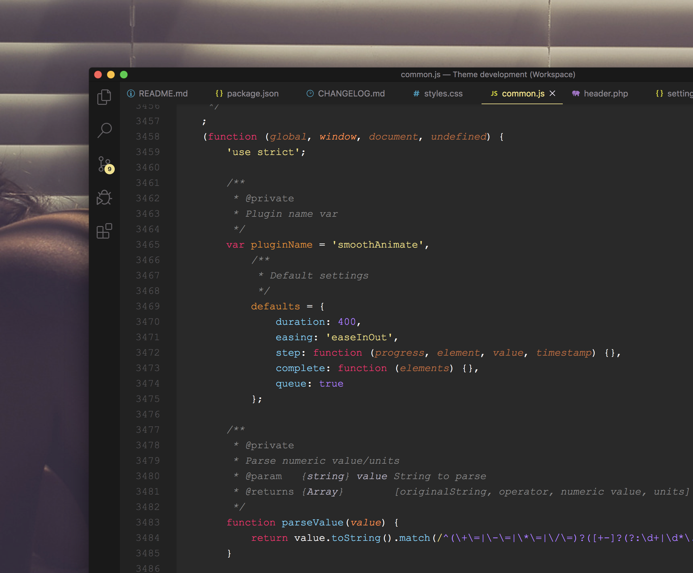

# Like A Pro theme Visual Studio Code

 - buy me a beer, I don't drink tho

Code like a Pro with the Like A Pro theme for VS Code.

#### Installation

* Open the Extensions sidebar in VS Code
* Search for Like A Pro theme
* Select it and click Install
* Open the Command Palette with Ctrl+Shift+P or ⇧⌘P
* Enter Preferences: Color Theme and select Like A Pro theme.
* Now you're one step closer to code like a Pro! 🎉 

### Support Languages

 - HTML
 - CSS
   - SCSS
 - JavaScript
   - JSON
 - Python
 - PHP

### [Premium WordPress themes](https://likeaprothemes.com) License

MIT

 - support

